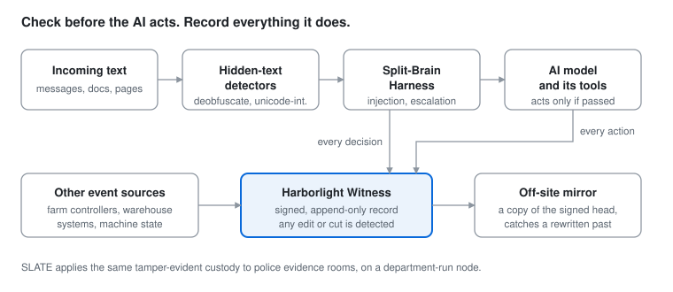

<h1 align="center">SGAIL Labs</h1>

  <strong>Evidence you can check, and a second opinion before an AI acts.</strong> 
  Tamper-evident records for AI agents, farms, warehouses and police evidence rooms,
  and the checks that catch hidden instructions before they reach a model.

  <a href="https://bigblue-r4.github.io/sgail-playground/witness/"><strong>Try to tamper with a farm log →</strong></a>
  &nbsp;·&nbsp;
  <a href="https://bigblue-r4.github.io/sgail-playground/"><strong>See hidden text in any message →</strong></a>
   Both run the real code in your browser. Nothing you type is sent anywhere.

  

---

### Where it's used

| | The problem | What we bring | Start here |
|---|---|---|---|
| 🤖 **AI agent machines** | An agent's actions and the machine it runs on need a record nobody can quietly rewrite | The Witness logs drift, network activity and agent events to a signed, append-only log, plus an off-site mirror | [kiss-protocol](https://github.com/bigblue-r4/kiss-protocol) |
| 🐔 **Poultry farms** | Remote setting changes, alarms, door access and health records, with disputes, audits and insurance to answer | Farm events sealed as they happen; nothing lost when the recorder restarts; an alarm when a house controller goes quiet | [harborlight-poultry-demo](https://github.com/bigblue-r4/harborlight-poultry-demo) · [try it](https://bigblue-r4.github.io/sgail-playground/witness/#full) |
| 📦 **Warehouses** | AI suggestions on the floor need a human in charge and an audit trail | An offline edge node (prototype): the AI may only *suggest*, a person accepts, and every step is written to a witness ledger | Private, demo on request |
| 🚓 **Police evidence rooms** | Chain of custody that holds up in court, without a cloud service | SLATE: an encrypted, tamper-evident custody log on a department-run node, with role-based access and signed court exports | [slate](https://github.com/bigblue-r4/slate) |
| 💬 **Anything that feeds text to a model** | Instructions hidden in look-alike letters, invisible characters or encodings | Detectors that undo the hiding step by step, then a reasoning check that flags injection and escalation before a response | [split-brain-harness](https://github.com/bigblue-r4/split-brain-harness) · [try it](https://bigblue-r4.github.io/sgail-playground/) |

### Harborlight: the evidence stack

| Project | What it is | |
|---|---|---|
| **[kiss-protocol](https://github.com/bigblue-r4/kiss-protocol)** | **The Witness.** Tamper-evident machine-state logging for AI agent environments: an RFC 6962 Merkle log with signed tree heads, off-site mirror audit, restart-safe event feeds (Pipelock, split-brain-harness, farm controllers), and a separate enforcer process with a gossip mesh. Cosign-signed releases. | `Go` · v3.3.3 |
| **[slate](https://github.com/bigblue-r4/slate)** | **Secure Log Audit for Trace Evidence.** Chain-of-custody evidence management for law enforcement: local, offline-first, encrypted hash-chained audit log, signed truncation anchor, Ed25519-signed court export bundles. | `Go` · v1.5.0 |
| **[harborlight-poultry-demo](https://github.com/bigblue-r4/harborlight-poultry-demo)** | A 30-second, self-contained run of the Witness on a simulated poultry operation: normal logging, an outage and catch-up, a silent house, and three tampering attempts caught. | `Go` |
| **harborlight-node** | Edge-first warehouse advisory node (working prototype). Runs offline on site hardware; the AI is advisory-only behind a policy gate and a human review queue; one-way batch sync to a cloud mirror. *Private; demo on request.* | `Rust` |

### Split-Brain Harness: a second opinion before the model acts

| Project | What it is | |
|---|---|---|
| **[split-brain-harness](https://github.com/bigblue-r4/split-brain-harness)** | A Rust security layer that wraps any LLM as a drop-in proxy and checks each request for prompt injection, insider-threat patterns, authority impersonation and multi-turn escalation before a response is generated. Every decision can be logged to the Witness. Benchmarks and their limits are published in the repo. | `Rust` · [crates.io](https://crates.io/crates/split-brain-harness) |

### Detection libraries (MIT)

| Project | What it is | |
|---|---|---|
| **[deobfuscate-rs](https://github.com/bigblue-r4/deobfuscate-rs)** | Multi-pass text deobfuscation and encoding-evasion detection for LLM pipelines: homoglyphs, invisible characters, base64, ROT13, split keywords and more. | `Rust` · [crates.io](https://crates.io/crates/deobfuscate) |
| **[unicode-interference](https://github.com/bigblue-r4/unicode-interference)** | Finds look-alike letters from other alphabets hidden in Latin text, via forward/reverse script interference. | `Rust` · [crates.io](https://crates.io/crates/unicode-interference) |
| **[deobfuscate-vision](https://github.com/bigblue-r4/deobfuscate-vision)** | Image-borne prompt-injection detection, the multimodal companion to the text engine. | `Rust` |
| **[glyph-validator](https://github.com/bigblue-r4/glyph-validator)** | Deterministic CJK glyph geometric-coherence validator. No LLM, no network. | `Python` |
| **[sgail-playground](https://github.com/bigblue-r4/sgail-playground)** | The in-browser demos above, built from the published crates and the Witness code via WebAssembly. | `Rust` · `Go` |

### Research and prior art

| Project | What it is |
|---|---|
| **[mirror-node-reconnaissance](https://github.com/bigblue-r4/mirror-node-reconnaissance)** | A defensive, consent-based simulation harness for studying isolated model agents: witness logging, drift scoring and rapid state revocation, entirely in simulation. |
| **[thumb-server](https://github.com/bigblue-r4/thumb-server)** | Prior-art disclosure: Topological Photonic Thumb-Server architecture. |

---

**How we build.** Detection and evidence, not promises: every repo says what it does *not* do, benchmark corrections stay on the record, and security fixes ship with a plain notice in the release notes. Minimal third-party surface, components kept in their lanes, offline-first where it matters.

  SGAIL Labs — North Shore, Oʻahu, Hawaiʻi · Montana LLC / Delaware C-Corp

